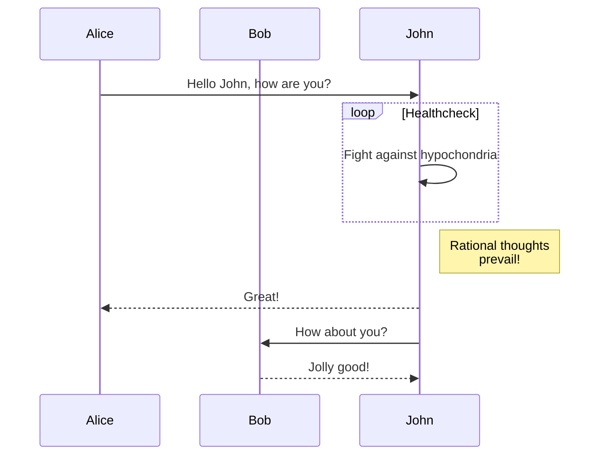

# Introduction to Remote File Inclusion (RFI)

Remote File Inclusion, or RFI, invokes the tactics of a threat actor sending a specially crafted package to a target subsequently triggering it to run arbitrary code from a remote location, such as a server the threat actor is hosting.

## Subheading - Methodology

Text here

## Another subheading

### Subsequent heading

text

# Larger heading

text
